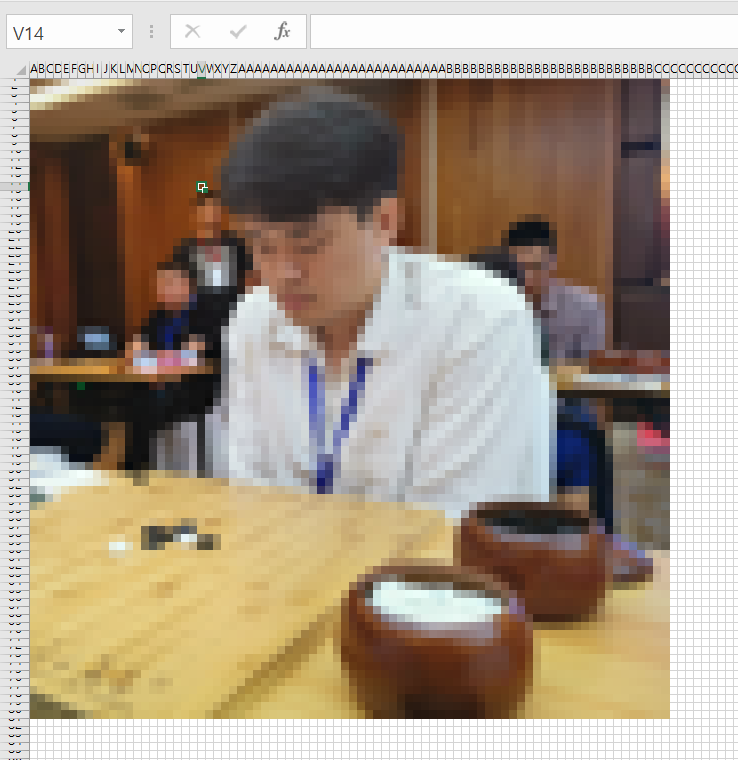

## ✍✍ Drawing-Excel-Pixel-Art ✍✍
Drawing Excel Pixel Art using Python !!


***
### 🎢 Environment
```
pip install -r requirements.txt
```

***
### 🏃‍♀️ Run
```
python img2exl.py -W 50 -H 50 --path sample.jpeg
```
***
### 📥 Input Image


***
### 📤 Output excel file
